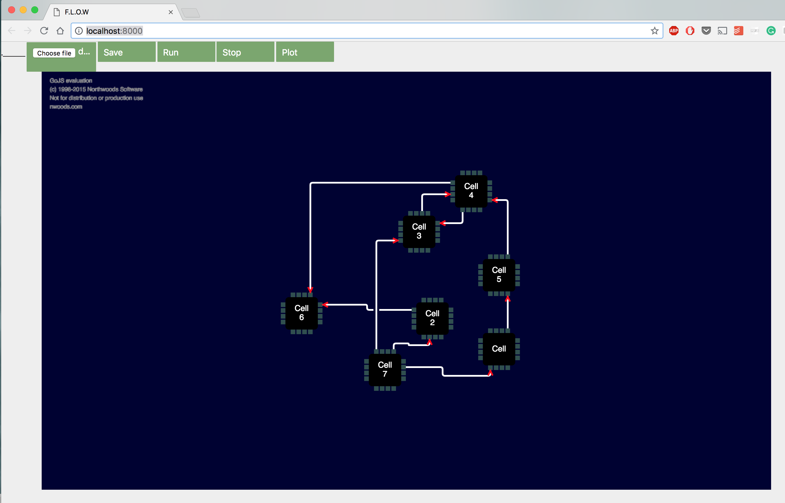

Visual programming browser
===============================





A visual programming Python/Javascript interface to quickly connect python modules and run the workflow.


Dependencies
------------

This program uses Tornado to handle the mess of communication.
```
pip install tornado
```

and likely you'll want to use
```
Numpy
Scipy
Pylab
...
```


How to run the simulator
-----

Once the dependencies are met, just run

```
python server.py
```

It should automatically open http://localhost:8000/ in your browser.
